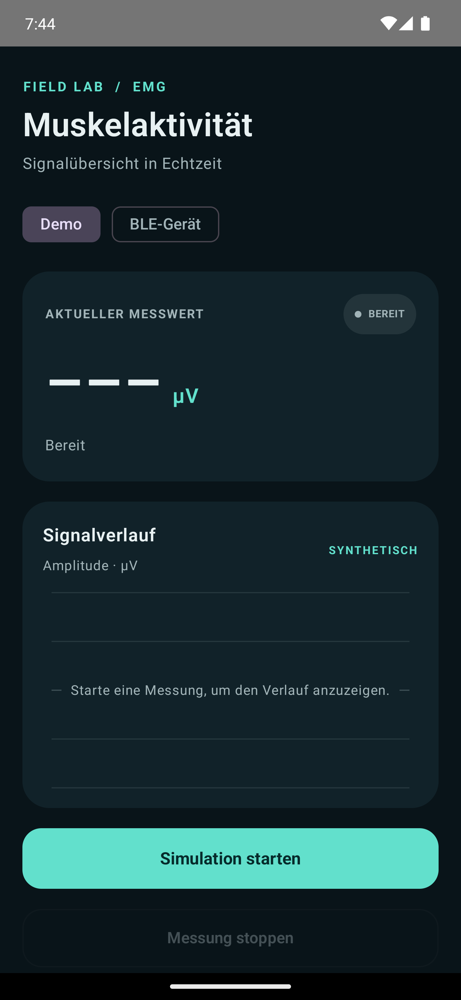
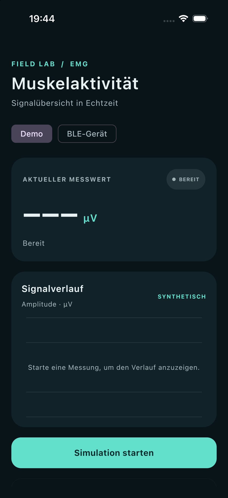
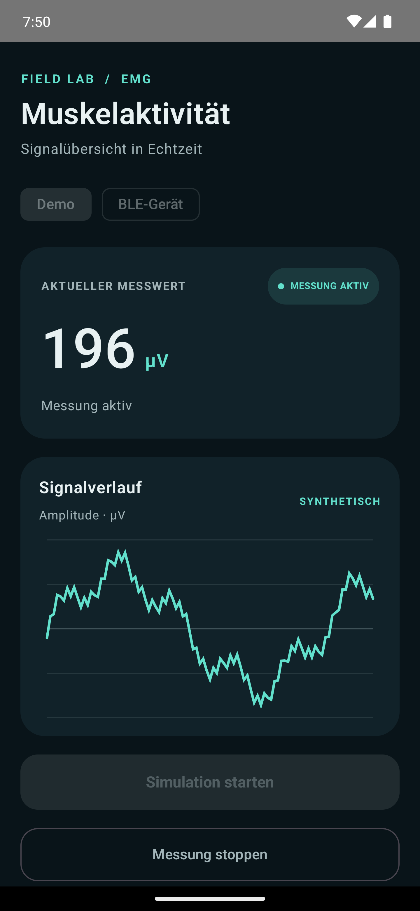
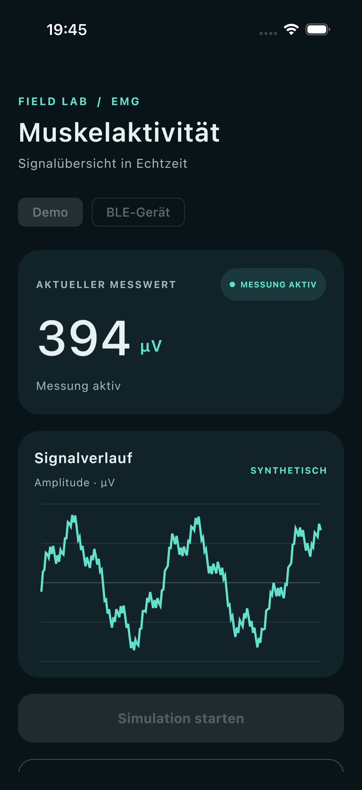
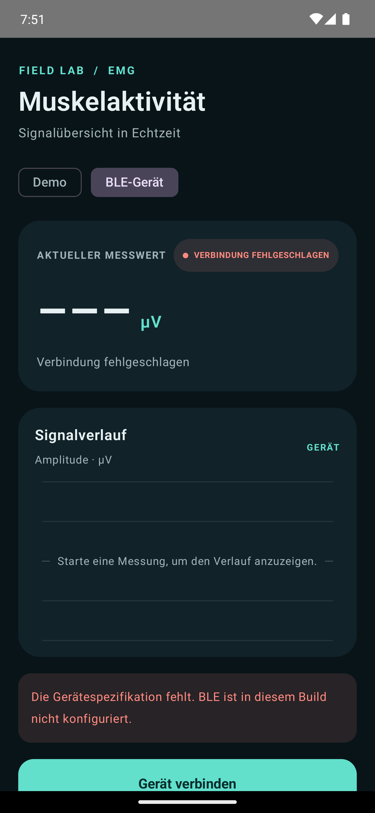
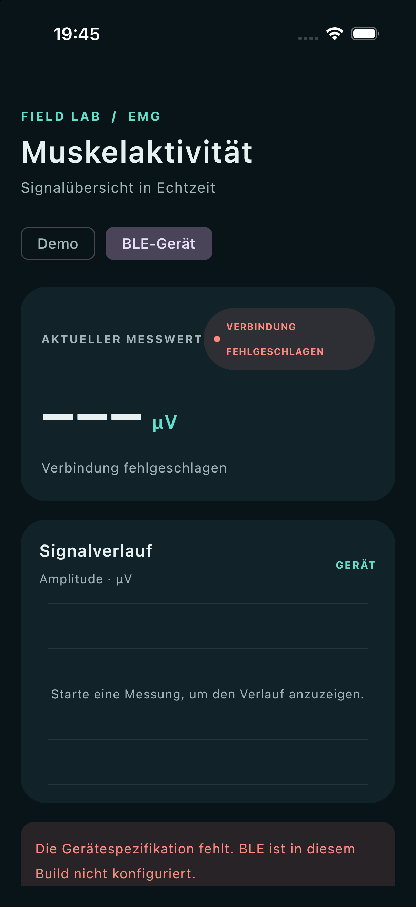
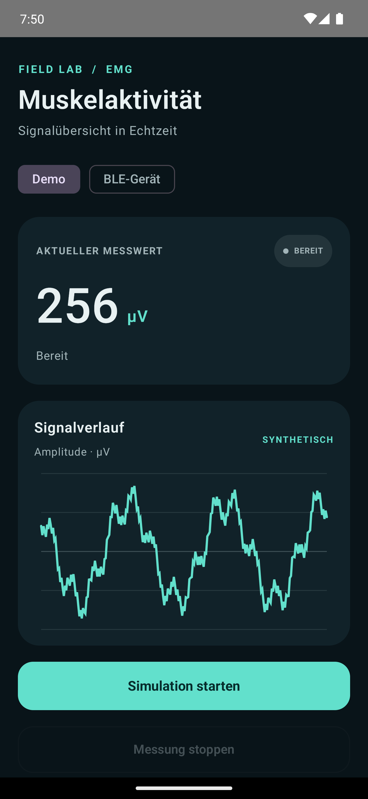
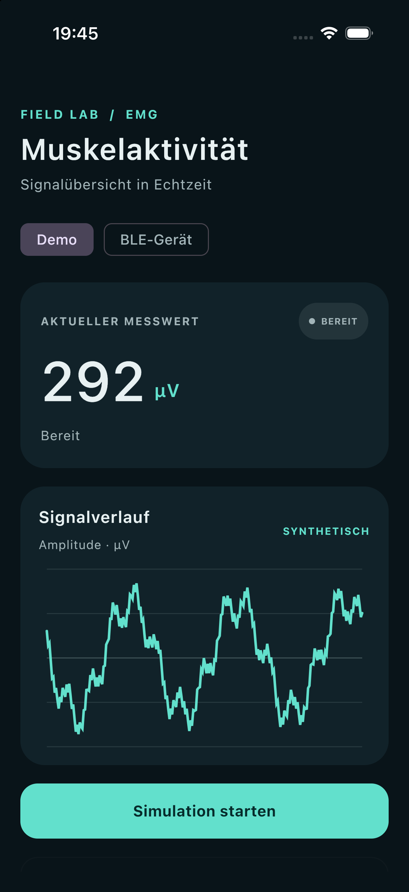

# EMG Companion

Kotlin-Multiplatform-App zur Anzeige von EMG-Messwerten unter Android und iOS. Die Demo-Quelle erzeugt synthetische Werte.

## Architektur

```text
Nutzeraktionen: Compose UI → ViewModel → Repository → Datenquelle
Messwerte:      Compose UI ← ViewModel ← Repository ← Datenquelle
```

Die Oberfläche zeigt den Zustand des ViewModels an und leitet Nutzeraktionen an es weiter. Das Repository wählt die Demo- oder BLE-Datenquelle. Kable dient als BLE-Transport. Da die Fallstudie kein konkretes Geräteprotokoll vorgibt, ist die BLE-Quelle noch nicht für ein bestimmtes Gerät konfiguriert.

## Screenshots

Die Aufnahmen zeigen Start, laufende Simulation, fehlende BLE-Gerätekonfiguration und den Stopp mit erhaltenem Signalverlauf.

| Zustand | Android | iOS |
| --- | --- | --- |
| Start | <a href="docs/screenshots/android/start.png"></a> | <a href="docs/screenshots/ios/start.png"></a> |
| Simulation läuft | <a href="docs/screenshots/android/live.png"></a> | <a href="docs/screenshots/ios/live.png"></a> |
| BLE-Gerät nicht konfiguriert | <a href="docs/screenshots/android/ble-error.png"></a> | <a href="docs/screenshots/ios/ble-error.png"></a> |
| Gestoppt, Verlauf erhalten | <a href="docs/screenshots/android/stopped.png"></a> | <a href="docs/screenshots/ios/stopped.png"></a> |

## Lokal starten

Voraussetzungen: JDK 17, Android Studio mit Android SDK 37 sowie für iOS macOS, Xcode und eine iOS-Simulator-Runtime.

**Android:** Projekt in Android Studio öffnen, Gradle Sync abwarten und `androidApp` ausführen.

**iOS:** `iosApp/iosApp.xcodeproj` öffnen, das Scheme **EMGCompanion** und einen iPhone-Simulator wählen, dann **Run** starten.

Die gemeinsamen Unit-Tests startest du mit:

```bash
./gradlew :composeApp:allTests
```
